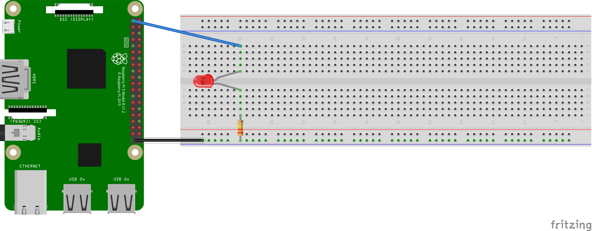
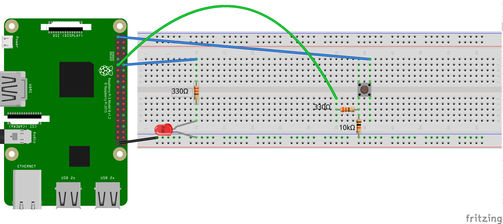
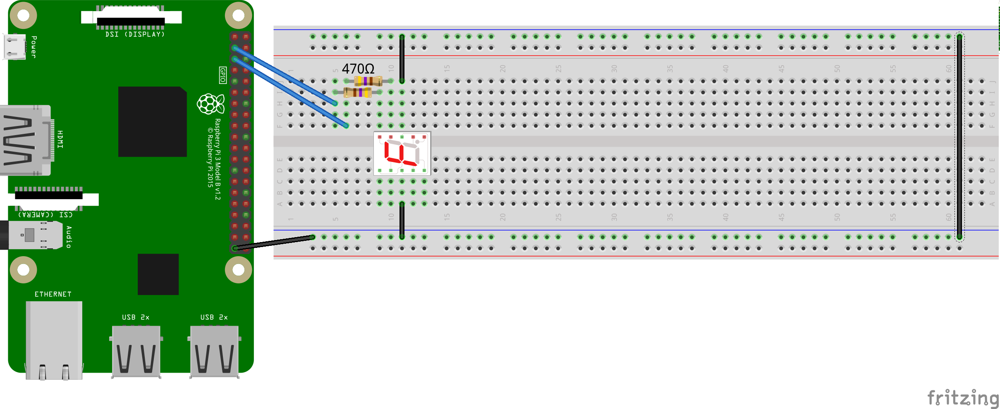

# Raspberry Pi

<!-- MDTOC maxdepth:2 firsth1:2 numbering:0 flatten:0 bullets:1 updateOnSave:1 -->

- [Einstieg in das RPi](#einstieg-in-das-rpi)   
   - [Beispiel-Projekt](#beispiel-projekt)   
- [PINs und GPIOs/BCMs](#pins-und-gpiosbcms)   
- [LED-Test](#led-test)   
   - [Arbeitsaufträge mit LEDs](#arbeitsaufträge-mit-leds)   
- [Try](#try)   
- [Inputs](#inputs)   
   - [Arbeitsaufträge mit Schalter](#arbeitsaufträge-mit-schalter)   
- [LED dimmen](#led-dimmen)   
   - [Arbeitsauftrag](#arbeitsauftrag)   
- [7-Segmentanzeige](#7-segmentanzeige)   
- [Kamera](#kamera)   
   - [Arbeitsaufträge mit der Kamera](#arbeitsaufträge-mit-der-kamera)   
- [Langzeit-Projekte](#langzeit-projekte)   
   - [Morse-Code](#morse-code)   
   - [Lärmanzeige](#lärmanzeige)   
   - [Alarmanlage für die Schublade](#alarmanlage-für-die-schublade)   
   - [LED-Kette](#led-kette)   
   - [Weitere Projekt-Ideen](#weitere-projekt-ideen)   

<!-- /MDTOC -->

## Einstieg in das RPi
[Mehr Kurz-Infos](http://xcosx.de/raspberry-pi-30-e-pc-mit-vielen-einsatzmoeglichkeiten/)

[RPi-Setup](RPi-Setup.md)

Ich habe für die Vorbereitung der folgenden Unterrichtsstunden übrigens das [Skript von Volker](https://ask.linuxmuster.net/t/raspberry-pi-im-unterricht/1818) verwendet.

### Beispiel-Projekt
Mit dem RPi kann man zum Beispiel ein [altes Radio zum Internetradio](http://hackaday.com/2015/05/03/tubenetradio-project-modernizes-1959-tube-radio/) aufpeppeln.

Material-Bedarf:

1. RPi
1. Stromkabel (Micro-USB)
1. HDMI-Kabel (für die Installation ganz praktisch)
1. Mini-SD-Karte
1. SD-Karten-Adapter (evtl. für die Installation)
1. Lautsprecher mit Line-In-Kabel

## PINs und GPIOs/BCMs

Was welcher PIN kann: [1](https://www.raspberrypi.org/documentation/usage/gpio-plus-and-raspi2/images/physical-pin-numbers.png), [2](http://elinux.org/RPi_Low-level_peripherals#Model_A.2B.2C_B.2B_and_B2), [3](https://pinout.xyz/pinout/pin12_gpio18#), [4](http://www.panu.it/raspberry/)

Informationen zum [Steckbrett](https://www.youtube.com/watch?v=tSFfa4bXGDE).

Die Stromversorgung über den USB-Anschluss des Computers reicht für die ersten Stunden.

## LED-Test
<!-- 28 -->
> Wie viel Ampere sind 1200 mA?

> Wenn eine LED die Beschriftung **2 V, 10 mA** trägt, welchen Widerstand muss man dann (mindestens) verwenden?

[Lösung](https://www.raspberrypi.org/forums/viewtopic.php?t=96908)

Bei der [LED](https://de.wikipedia.org/wiki/Leuchtdiode#Betrieb_und_Anschluss) geht der *kürzere Fuß zur Erde* (zum niedrigeren Potential, zur Kathode, zum Minus). Ob der Widerstand rechts oder links ist, ist egal.



##LED on/off
<!-- 49 -->


```python
#!/usr/bin/env python3
# -*- coding: utf-8 -*-

import RPi.GPIO as GPIO
from time import sleep

# Die Nummerierungen der PINs auf die physikalische Nummerierungen (1-40) festlegen.
GPIO.setmode(GPIO.BOARD)

# PIN als Ausgänge definieren
GPIO.setup(12, GPIO.OUT)

# Einschalten des PINs und 5 Sekunden warten. Statt 'GPIO.HIGH' kann man auch '1' oder 'True' schreiben. Statt 'GPIO.LOW' geht auch '0' oder 'False'.
GPIO.output(12, GPIO.HIGH)
sleep(5)

# Den Ausgangszustand wiederherstellen. Bitte immer hinzufügen, um das RPi nicht zu beschädigen.
GPIO.cleanup()
```

### Arbeitsaufträge mit LEDs

1. Lasse eine LED fünf Mal für je eine Sekunde blinken. (Code-Länge = 10 Zeilen.)
1. Lasse zwei LEDs fünf Mal für je eine Sekunde blinken.
1. Lasse zwei LEDs abwechselnd blinken.
1. Verwende vier LEDs und lasse abwechselnd jeweils zwei gleichzeitig blinken.
1. Verwende vier LEDs um *Knight-Rider* zu programmieren.

Tipp zur Code-Optimierung: Die GPIO-Befehle verstehen auch Listen:

```python
led_pins = [11,12]
GPIO.setup(led_pins, GPIO.OUT)
GPIO.output(led_pins, 0)
```

## Try

Wenn man ein Programm abbricht, weil es nicht so funktioniert wie man sich das gedacht hat, hat man ein Problem: Das `cleanup` wird nicht aufgerufen. Verwendet daher bitte den `try-except`-Befehl im folgenden Beispiel:

```python
#!/usr/bin/env python3
# -*- coding: utf-8 -*-
import RPi.GPIO as GPIO
from time import sleep
GPIO.setmode(GPIO.BOARD)
GPIO.setup(12, GPIO.OUT)
print('Diese Programm kann man mit Strg+C abbrechen, ohne das RPi kaputt zu machen.')
try:
    while True:
        GPIO.output(12, GPIO.HIGH)
        sleep(1)
        GPIO.output(12, GPIO.LOW)
        sleep(1)
except KeyboardInterrupt:
    GPIO.cleanup()
```

## Inputs
Jetzt wollen wir einen GPIO als Input verwenden, d.h. wir wollen am angeschlossenen Pin (Nr. 11) messen, ob der Stromkreis zwischen 3,3 V, Schalter, Widerstand und Erde gerade offen oder geschlossen ist. Bei geschlossenem Stromkreis, also wenn die Taste gedrückt ist, soll die LED leuchten.

Den Schalter, auch Taster oder Pushbutton genannt, schließen wir bitte so an. Auf den kleinen Widerstand (200-400 Ohm) kann man zwar verzichten, wenn man richtig programmiert, aber wer weiß, ob man nicht einmal unkonzentriert ist und dann das RaspberryPi einen Kurzschluss bekommt.




```python
#!/usr/bin/env python3
# -*- coding: utf-8 -*-
import RPi.GPIO as GPIO
from time import sleep
GPIO.setmode(GPIO.BOARD)
GPIO.setup(12, GPIO.OUT)
# Um vom Pin 11 ein Signal empfangen zu können, wird er hier als GPIO.IN definiert. Das `pull_up_down` definiert einen Vorwiderstand, der einen Kurzschluss verhindert.
GPIO.setup(11, GPIO.IN, pull_up_down = GPIO.PUD_DOWN)
print('Diese Programm kann man mit Strg+C abbrechen, ohne das RPi kaputt zu machen.')
try:
    while True:
        # In der Variable taster_int wird der Wert gespeichert, den der Pin 11 liefert, also ob der Stromkreis geschlossen ist oder nicht, also entweder 0 oder 1.
        taster_int = GPIO.input(11)
        if taster_int == 1:
            GPIO.output(12, GPIO.HIGH)
        else:
            GPIO.output(12, GPIO.LOW)
except KeyboardInterrupt:
    GPIO.cleanup()
```

Verwendet man die ausgelesene `1` bzw. `0` direkt, braucht man die vier Zeilen der if-Anweisung nicht zu schreiben. Man kann allerdings darüber streiten, ob der Code dann noch besonders gut zu lesen ist.
```python
GPIO.output(12, taster_int)
```

### Arbeitsaufträge mit Schalter

1. Simple **Alarmanlage**: Beim Schließen des Schalters soll eine LED ganz wild blinken.
1. Auf Tastendruck soll eine **Ampel** für 5 Sekunden auf rot schalten und dann wieder auf grün.

## LED dimmen

Für das Dimmen kann man die Pulweitenmodulation (PWM) benutzen. Ein Puls besteht aus Breite (Zeit, 50 Hz entspricht 20 ms) und Höhe (Intensität).

Es wird empfohlen, den *GPIO18* zu verwenden, weil er *Hardware-PWM* unterstützt.

Im Wesentlichen wird ein Objekt mit einer bestimmten (PWM-)Frequenz definiert, gestartet und mit `ChangeDutyCycle(i)` auf die Helligkeit `i` gesetzt ($$ 0 \leq i \leq 100 $$).

```python
import RPi.GPIO as GPIO
from import time import sleep
GPIO. setmode(GPIO.BOARD)
GPIO.setup(18,GPIO.OUT)
# Ein Objekt p wird mit PWM definiert. 18 ist der Pin, 50 ist Frequenz 50 Hz. 0,5 Hz sind 2 Sekunden.
p = GPIO.PWM(18,50)
# Das Objekt p wird gestartet, wobei 0 bedeutet, dass die Höhe 0 ist. 50 würde bedeuten, dass der Puls zu 50 % auf hight gesetzt wäre.
p.start(0)
try:
    # Im Folgenden wird die LED abwechselnd heller und dunkler.
    while True:
        # Die letzte Ziffer in range gibt die Schritte an, mit der die Zahlen i von 0 bis 100 in jedem Schritt wachsen.
        for i in range(0,101,5):
            # Jetzt ändern wir die Helligkeit. ChangeDutyCycle erwartet eine Zahl (int oder float).
            p.ChangeDutyCycle(i)
            # Verzögerung:
            sleep(0.1)
        for i in range(100,-1,-5):
            p.ChangeDutyCycle(i)
            sleep(0.1)
except KeyboardInterrupt:
    # Beendet die PWM:
    p.stop()
    GPIO.cleanup()
```    

### Arbeitsauftrag

* Lasse zwei LEDs sich gegenläufig dimmen.

## 7-Segmentanzeige
7-Segmentanzeigen werden bei ihren mittleren Pins an der Erde angeschlossen. Den Rest der [Pinbelegung unserer 7-Segmentanzeigen](https://www.mymakerstuff.de/2016/05/12/die-siebensegmentanzeige#cc-m-header-13360887824) kannst du nachlesen oder selbst herausfinden. Verwende bitte 470-Ohm-Widerstände und wie immer `try`.



Wenn du z.B. von 0 bis 9 hochzählen lassen willst oder eine Tastatureingabe eine bestimmte Anzeige bewirken soll, solltest du [Listen und Dictionaries](python.md#pl-kollektionen) bei deiner Programmierung verwenden.

```python
...
zeige = ["a","b","ab"]
pin = {"a":3, "b":5}
# Auf die Werte greift man mit .values zu
for i in pin.values():
    GPIO.output(i,0)
# Auf die Schlüssel greift man mit eckiger Klammer zu
for k in range(len(zeige)):
    for i in zeige[k]:
        GPIO.output(pin[i],1)    
sleep(1)
for i in zeige[]:
    GPIO.output(pin[i],1)   
...
```

[Diese Codierung](https://www.mymakerstuff.de/2016/05/12/die-siebensegmentanzeige#cc-m-header-13360887824) könnte dir helfen, keinen Knoten im Hirn zu bekommen.

## Kamera

Um die Kamera benutzen zu können, muss man bei

```bash
sudo raspi-config
```
unter *camera* dieselbe durch Auswahl von **Enable** aktivieren. Speichern und ein Neustart sind nicht verkehrt.

**Bilder** kann man aufnehmen mit:

```bash
raspistill -o bild.jpg
```

Eine **Video** der Länge 10 Sekunden kann man z.B. aufnehmen mit:

```bash
raspivid -o video1.h264 -t 10000
```
Anschauen kann man ein Video mittels:

```bash
omxplayer video.h264
```

Weitere Informationen:
* [Offizielle Rpi-Seite](https://www.raspberrypi.org/documentation/raspbian/applications/camera.md)
* [Video aus Bilder erstellen](https://trevorappleton.blogspot.de/2013/11/creating-time-lapse-camera-with.html)
+ [Kamera als Bewegungsmelder](www.pcpro.co.uk/features/386086/make-a-motion-sensing-camera-with-the-raspberry-pi)
* [Weitere Anleitungen zur Kamera](http://kampis-elektroecke.de/?page_id=4129)

### Arbeitsaufträge mit der Kamera

* Programmiere einen Fotoapparat, d.h. durch einen Taster soll ein Bild aufgenommen werden.


<div class="page-break"></div>
## Langzeit-Projekte

Tipp: Die Stationen sehen cooler aus, wenn du keine herkömmlichen Mechaniken verwendest, z.B. statt einem Plastikschalter eine Wäscheklammer.

### Morse-Code
Schreibe ein Programm, das Text zu Morse-Code übersetzt und die LED in entsprechendem Rhythmus blinken lässt.

### Lärmanzeige

### Alarmanlage für die Schublade

### LED-Kette

[Anleitung zum Steuern einer LED-Kette](http://popoklopsi.github.io/RaspberryPi-LedStrip/#!/ )

* [Mosfets](http://www.ebay.de/sch/i.html?_from=R40&_trksid=p2050601.m570.l1313.TR0.TRC0.H0.Xirlz34n.TRS0&_nkw=irlz34n&_sacat=0)

* [Lichterkette](http://www.ebay.de/itm/5m-RGB-LED-STRIP-BAND-LEISTE-STRIPE-STREIFEN-LICHTKETTE-LICHT-LICHTER-5050-SMD-/321874918415?hash=item4af13d7c0f:g:Nu8AAOSwHjNWBBBt)

### Weitere Projekt-Ideen

* Größere 7-Segmentanzeige [1](https://www.rahner-edu.de/mikrocontroller/propeller-controller/7-segment-anzeige/), [2](https://pi-buch.info/7-segment-anzeigen-am-raspberry-pi-ansteuern/)

* [Weitere Projekte auf der offiziellen Seite](https://www.raspberrypi.org/resources/make/)

* [tutorials-raspberrypi.de](http://tutorials-raspberrypi.de/)

* [selbst suchen](https://duckduckgo.com/?q=raspberry+projekte&kl=de-de&ia=web)
