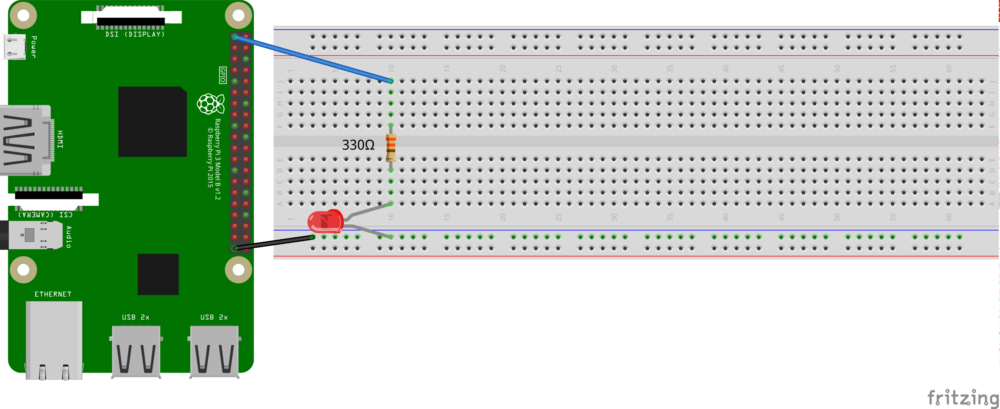

# Raspberry Pi

## PL: Einstieg in das RPi
[Mehr Kurz-Infos](http://xcosx.de/raspberry-pi-30-e-pc-mit-vielen-einsatzmoeglichkeiten/)

[RPi-Setup](RPi-Setup.md)

### Beispiel-Projekt Media-Station
Mit dem RPi kann man zum Beispiel ein [altes Radio zum Internetradio](http://hackaday.com/2015/05/03/tubenetradio-project-modernizes-1959-tube-radio/) aufpeppeln.

Material-Bedarf:

1. RPi
1. Stromkabel (Micro-USB)
1. HDMI-Kabel (für die Installation ganz praktisch)
1. Mini-SD-Karte
1. SD-Karten-Adapter (evtl. für die Installation)
1. Lautsprecher mit Line-In-Kabel

### PINs und GPIOs/BCMs

Was welcher PIN kann: [1](https://www.raspberrypi.org/documentation/usage/gpio-plus-and-raspi2/images/physical-pin-numbers.png), [2](http://elinux.org/RPi_Low-level_peripherals#Model_A.2B.2C_B.2B_and_B2), [3](https://pinout.xyz/pinout/pin12_gpio18#)

Informationen zum [Steckbrett](https://www.youtube.com/watch?v=tSFfa4bXGDE)

### LED-Test
<!-- 28 -->
Wie viel Ampere sind 1200 mA?
Wenn eine LED 1,8-2 V und 10-20 mA zum Leuchten benötigt, welchen Widerstand muss man dann verwenden? (U = RI)

Bei der LED geht der *kürzere* Fuß (negativ/Kathode) zum Widerstand.



### LED on/off
<!-- 49 -->


```python
#!/usr/bin/env python3
# -*- coding: utf-8 -*-

import RPi.GPIO as GPIO
from time import sleep

# Die Nummerierungen der PINs auf die physikalische Nummerierungen (1-40) festlegen.
GPIO.setmode(GPIO.BOARD)

# PIN als Ausgänge definieren
GPIO.setup(12, GPIO.OUT)

# Einschalten des PINs und 5 Sekunden warten. Statt 'GPIO.HIGH' kann man auch '1' oder 'True' schreiben. Statt 'GPIO.LOW' geht auch '0' oder 'False'.
GPIO.output(12, GPIO.HIGH)
sleep(5)

# Den Ausgangszustand wiederherstellen. Bitte immer hinzufügen, um das RPi nicht zu beschädigen.
GPIO.cleanup()
```

## PA: Arbeitsaufträge mit LEDs

1. Lasse eine LED fünf Mal für je eine Sekunde blinken. (Code-Länge = 10 Zeilen.)
1. Lasse zwei LEDs fünf Mal für je eine Sekunde blinken.
1. Lasse zwei LEDs abwechselnd blinken.
1. Verwende vier LEDs und lasse abwechselnd jeweils zwei gleichzeitig blinken.
1. Verwende vier LEDs um *Knight-Rider* zu programmieren.

Tipp zur Code-Optimierung: Die GPIO-Befehle verstehen auch Listen:

```python
led_pins = [11,12]
GPIO.setup(led_pins, GPIO.OUT)
GPIO.output(led_pins, 0)
```

## PL: Try

Wenn man ein Programm abbricht, weil es nicht so funktioniert wie man sich das gedacht hat, hat man ein Problem: Das `cleanup` wird nicht aufgerufen. Verwendet daher bitte den `try-except`-Befehl im folgenden Beispiel:

```python
#!/usr/bin/env python3
# -*- coding: utf-8 -*-
import RPi.GPIO as GPIO
from time import sleep
GPIO.setmode(GPIO.BOARD)
GPIO.setup(12, GPIO.OUT)
print('Diese Programm kann man mit Strg+C abbrechen, ohne das RPi kaputt zu machen.')
try:
  while True:
    GPIO.output(12, GPIO.HIGH)
    sleep(5)
except KeyboardInterrupt:
  GPIO.cleanup()
```

<!--
## PL: Inputs
http://maxembedded.com/2014/07/using-raspberry-pi-gpio-using-python/ -->


<div class="page-break"></div>

## Langzeit-Projekte

### LED-Kette

[Anleitung zum Steuern einer LED-Kette](http://popoklopsi.github.io/RaspberryPi-LedStrip/#!/ )

* [Mosfets](http://www.ebay.de/sch/i.html?_from=R40&_trksid=p2050601.m570.l1313.TR0.TRC0.H0.Xirlz34n.TRS0&_nkw=irlz34n&_sacat=0)

* [Lichterkette](http://www.ebay.de/itm/5m-RGB-LED-STRIP-BAND-LEISTE-STRIPE-STREIFEN-LICHTKETTE-LICHT-LICHTER-5050-SMD-/321874918415?hash=item4af13d7c0f:g:Nu8AAOSwHjNWBBBt)

### Weitere Projekt-Ideen

* [Weitere Projekte auf der offiziellen Seite](https://www.raspberrypi.org/resources/make/)

* [tutorials-raspberrypi.de](http://tutorials-raspberrypi.de/)

* [selbst suchen](https://duckduckgo.com/?q=raspberry+projekte&kl=de-de&ia=web)
