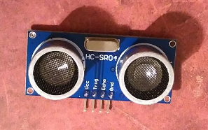

# Raspberry Pi

Zum Messen eines Abstandes, kann man verschiedene Typen von [Wegsensoren](https://de.wikipedia.org/wiki/Wegsensor) verwenden.

## Abstand mittels Ultraschallsensor HC-SR04


([HC-SR04 bei Reichelt](https://www.reichelt.de/DEBO-SEN-ULTRA/3/index.html?ACTION=3&GROUPID=8244&ARTICLE=161487&SEARCH=debo%2Bsen%2Bultra&START=0&OFFSET=16&))

[Tutorial zum HC-SR04](https://tutorials-raspberrypi.de/entfernung-messen-mit-ultraschallsensor-hc-sr04/)

Auf dem Sensor kann man vier Bezeichnungen *lesen*: VCC, Trig, Echo, GND.

* Die Bezeichnung **Trig** ist eine Abkürzung für **Trigger** und bedeutet *Auslöser*. Kommt hier Strom, wird ein Ultraschall-Signal gesendet.
* Ein **Echo** ist ein Hörereignis bei einer verzögerten Schallwelle. Hier wird also das Ultraschall-Signal empfangen.
* **GND** steht für Ground.
* Bei **VCC** wird 3V angelegt.

Das Skript verwendet die BCM-Bezeichnungen. Pin 18 ist z.B. BCM 24. Die Grunddefinition ist statt wie bisher
```python
GPIO.setmode(GPIO.BOARD)
```
hier:
```python
GPIO.setmode(GPIO.BCM)
```

Wenn dich das stört, musst du die Zeilen 6, 9 und 10 ändern.
