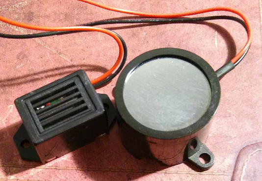
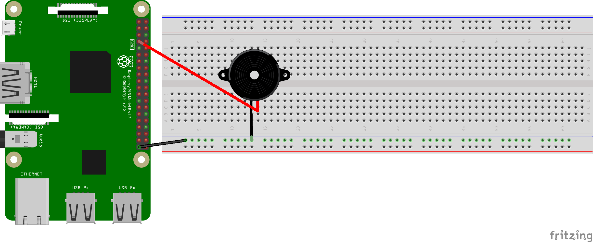

# Raspberry Pi
## Buzzer, Summer, Piepser, Piezo-Element
Wie auch immer man die Dinger nennt: Sie erzeugen einen Ton.



Das schwarze Kabel kann man an *Ground* anschießen, das rote an einen PIN.



Der folgende Code schaltet den Buzzer nach einer vorgegebenen Zeit aus, wenn er an ist und an, wenn er aus ist.

```python
import RPi.GPIO as GPIO
import time

PIN_BUZZER = 7
GPIO.setmode(GPIO.BOARD)
GPIO.setup(PIN_BUZZER, GPIO.OUT)
print("Programm wird mit STRG+C beendet")
Zustand = 1
try:
    while True:
        GPIO.output(PIN_BUZZER, Zustand)
        if Zustand == 1:
            Zustand = 0
        else:
            Zustand = 1
        time.sleep(0.1)
except KeyboardInterrupt:
    GPIO.cleanup()
```
