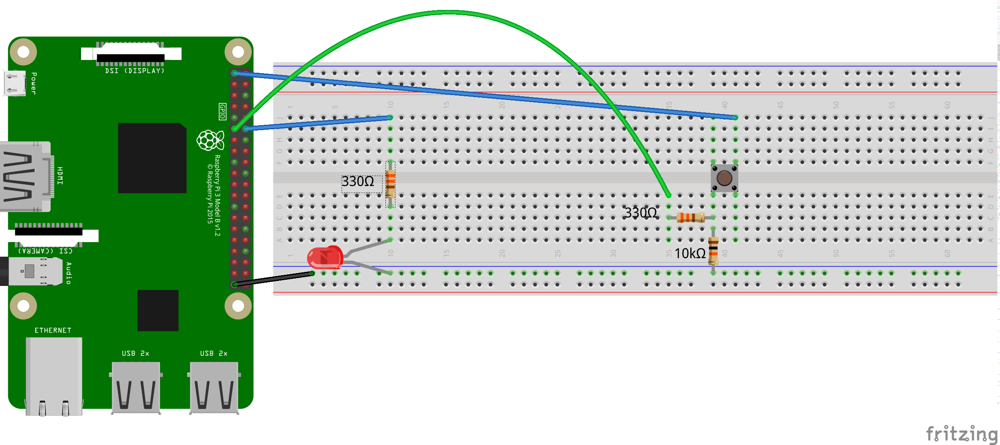

# Raspberry Pi

Denk daran, deinen Code in einer [Try-Schleife](RPi_Try.md) einzufügen.

## Druck-Taster
Jetzt wollen wir einen GPIO als Input verwenden, d.h. wir wollen am angeschlossenen Pin (Nr. 11) messen, ob der Stromkreis zwischen 3,3 V, Schalter, Widerstand und Erde gerade offen oder geschlossen ist. Bei geschlossenem Stromkreis, also wenn die Taste gedrückt ist, soll die LED leuchten.

Den Schalter, auch Taster oder Pushbutton genannt, schließen wir bitte so an. Auf den kleinen Widerstand (200-400 Ohm) kann man zwar verzichten, wenn man richtig programmiert, aber wer weiß, ob man nicht einmal unkonzentriert ist und dann das RaspberryPi einen Kurzschluss bekommt.




```python
#!/usr/bin/env python3
# -*- coding: utf-8 -*-
import RPi.GPIO as GPIO
from time import sleep
GPIO.setmode(GPIO.BOARD)
GPIO.setup(12, GPIO.OUT)
# Um vom Pin 11 ein Signal empfangen zu können, wird er hier als GPIO.IN definiert. Das `pull_up_down` definiert einen Vorwiderstand, der einen Kurzschluss verhindert.
GPIO.setup(11, GPIO.IN, pull_up_down = GPIO.PUD_DOWN)
print('Diese Programm kann man mit Strg+C abbrechen, ohne das RPi kaputt zu machen.')
try:
    while True:
        # In der Variable taster_int wird der Wert gespeichert, den der Pin 11 liefert, also ob der Stromkreis geschlossen ist oder nicht, also entweder 0 oder 1.
        taster_int = GPIO.input(11)
        if taster_int == 1:
            GPIO.output(12, GPIO.HIGH)
        else:
            GPIO.output(12, GPIO.LOW)
except KeyboardInterrupt:
    GPIO.cleanup()
```

Verwendet man die ausgelesene `1` bzw. `0` direkt, braucht man die vier Zeilen der if-Anweisung nicht zu schreiben. Man kann allerdings darüber streiten, ob der Code dann noch besonders gut zu lesen ist.
```python
GPIO.output(12, taster_int)
```

### Arbeitsaufträge mit Schalter

1. Simple **Alarmanlage**: Beim Schließen des Schalters soll eine LED ganz wild blinken.
1. Auf Tastendruck soll eine **Ampel** für 5 Sekunden auf rot schalten und dann wieder auf grün.
