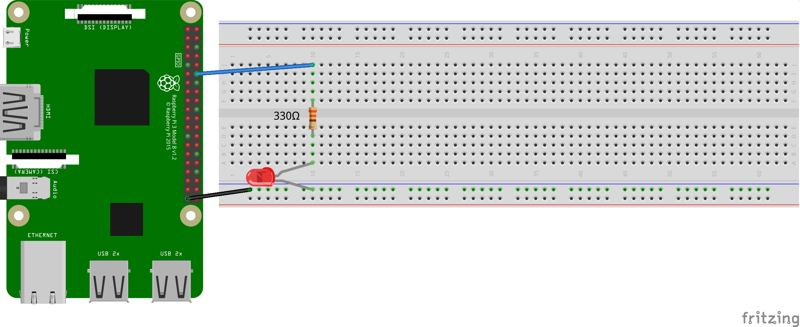

# Raspberry Pi
## LED-Test
<!-- 28 -->
> Wie viel Ampere sind 1200 mA?

> Wenn eine LED die Beschriftung **2 V, 10 mA** trägt, welchen Widerstand muss man dann (mindestens) verwenden?

[Lösung](https://www.raspberrypi.org/forums/viewtopic.php?t=96908)

Bei der [LED](https://de.wikipedia.org/wiki/Leuchtdiode#Betrieb_und_Anschluss) geht der *kürzere Fuß zur Erde* (zum niedrigeren Potential, zur Kathode, zum Minus). Ob der Widerstand rechts oder links ist, ist egal.


## LED an/aus
<!-- 49 -->


```python
#!/usr/bin/env python3
# -*- coding: utf-8 -*-

import RPi.GPIO as GPIO
from time import sleep

# Die Nummerierungen der PINs auf die physikalische Nummerierungen (1-40) festlegen.
GPIO.setmode(GPIO.BOARD)

# PIN als Ausgänge definieren
GPIO.setup(12, GPIO.OUT)

# Einschalten des PINs und 5 Sekunden warten. Statt 'GPIO.HIGH' kann man auch '1' oder 'True' schreiben. Statt 'GPIO.LOW' geht auch '0' oder 'False'.
GPIO.output(12, GPIO.HIGH)
sleep(5)

# Den Ausgangszustand wiederherstellen. Bitte immer hinzufügen, um das RPi nicht zu beschädigen.
GPIO.cleanup()
```

### Arbeitsaufträge mit LEDs

1. Lasse eine LED fünf Mal für je eine Sekunde blinken. (Code-Länge = 10 Zeilen.)
1. Lasse zwei LEDs fünf Mal für je eine Sekunde blinken.
1. Lasse zwei LEDs abwechselnd blinken.
1. Verwende vier LEDs und lasse abwechselnd jeweils zwei gleichzeitig blinken.
1. Verwende vier LEDs um *Knight-Rider* zu programmieren.

Tipp zur Code-Optimierung: Die GPIO-Befehle verstehen auch Listen:

```python
led_pins = [11,12]
GPIO.setup(led_pins, GPIO.OUT)
GPIO.output(led_pins, 0)
```

## LED dimmen

Für das Dimmen kann man die Pulweitenmodulation (PWM) benutzen. Ein Puls besteht aus Breite (Zeit, 50 Hz entspricht 20 ms) und Höhe (Intensität).

Es wird empfohlen, den *GPIO18* zu verwenden, weil er *Hardware-PWM* unterstützt.

Im Wesentlichen wird ein Objekt mit einer bestimmten (PWM-)Frequenz definiert, gestartet und mit `ChangeDutyCycle(i)` auf die Helligkeit `i` gesetzt ($$ 0 \leq i \leq 100 $$).

```python
import RPi.GPIO as GPIO
from import time import sleep
GPIO. setmode(GPIO.BOARD)
GPIO.setup(18,GPIO.OUT)
# Ein Objekt p wird mit PWM definiert. 18 ist der Pin, 50 ist Frequenz 50 Hz. 0,5 Hz sind 2 Sekunden.
p = GPIO.PWM(18,50)
# Das Objekt p wird gestartet, wobei 0 bedeutet, dass die Höhe 0 ist. 50 würde bedeuten, dass der Puls zu 50 % auf hight gesetzt wäre.
p.start(0)
try:
    # Im Folgenden wird die LED abwechselnd heller und dunkler.
    while True:
        # Die letzte Ziffer in range gibt die Schritte an, mit der die Zahlen i von 0 bis 100 in jedem Schritt wachsen.
        for i in range(0,101,5):
            # Jetzt ändern wir die Helligkeit. ChangeDutyCycle erwartet eine Zahl (int oder float).
            p.ChangeDutyCycle(i)
            # Verzögerung:
            sleep(0.1)
        for i in range(100,-1,-5):
            p.ChangeDutyCycle(i)
            sleep(0.1)
except KeyboardInterrupt:
    # Beendet die PWM:
    p.stop()
    GPIO.cleanup()
```

### Arbeitsauftrag zum Dimmen von LEDs

* Lasse zwei LEDs sich gegenläufig dimmen.
