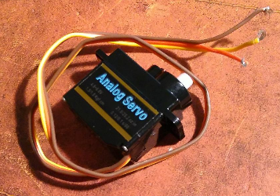
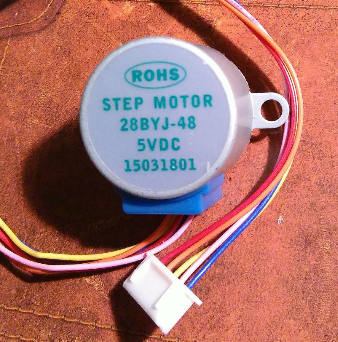

# Raspberry Pi
## Servo-Motor

[Anleitung](https://tutorials-raspberrypi.de/raspberry-pi-servo-motor-steuerung/)

## Schrittmotor

Um den Stepper-Motor anzuschließen, müssen wir einen Treiber verwenden, damit die Stromstärken stimmen. Wir haben den Treiber mit der Bezeichnung [UL2803A](https://learn.adafruit.com/adafruits-raspberry-pi-lesson-10-stepper-motors?view=all#hardware-uln2803). Hier befindet sich auch eine Anleitung.
